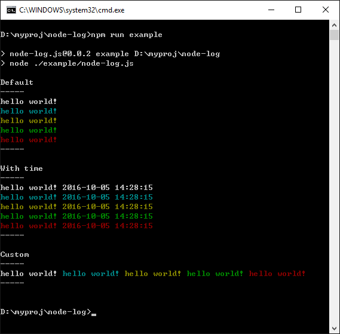

# node-log.js

[](https://github.com/cntanglijun/node-log)
[](https://www.npmjs.com/package/node-log.js)
[](https://github.com/cntanglijun/node-log.js)
[](https://github.com/cntanglijun/node-log.js/tags)
[](https://github.com/cntanglijun/node-log.js/releases)
[](https://raw.githubusercontent.com/cntanglijun/node-log.js/master/LICENSE.md)

Get colors in your node.js console

[](https://github.com/cntanglijun/node-log.js)

## Installation

```bash
npm i node-log --save
```

## Usage

```js
const log = require('node-log.js');

const testStr = 'hello world!'

log.normal(testStr);
log.info(testStr);
log.warn(testStr);
log.success(testStr);
log.error(testStr);
log.custom(testStr);
```

## API

| API | Utility |
|:-:|:-:|
| log.normal | output with white color |
| log.info | output with cyan color |
| log.warn | output with yellow color |
| log.success | output with green color |
| log.error | output with red color |
| log.custom | wrapper for log.normal |

## Example

```bash
npm run example
```

## License

MIT